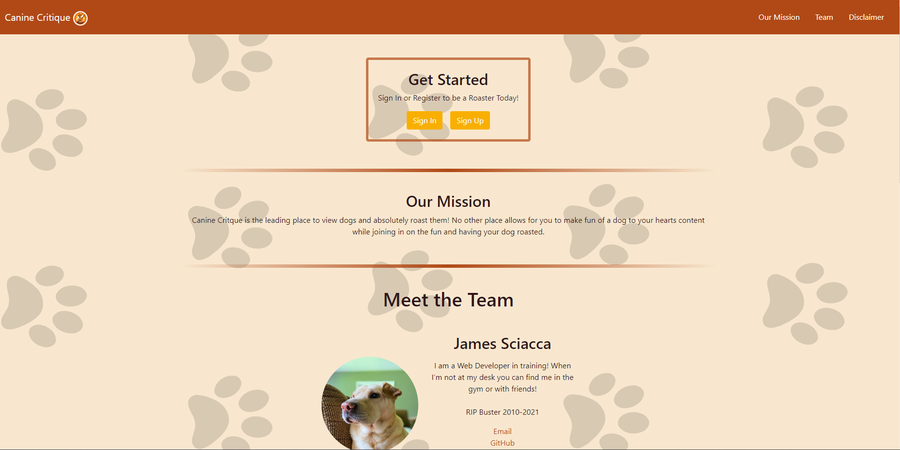
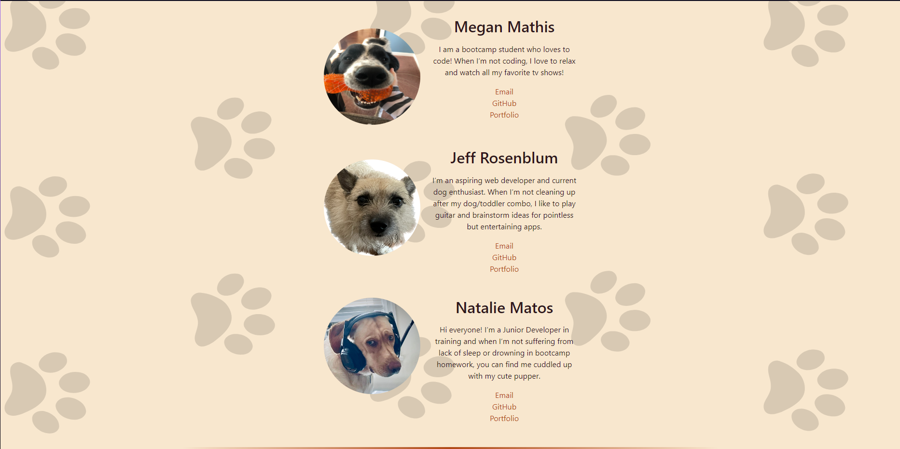
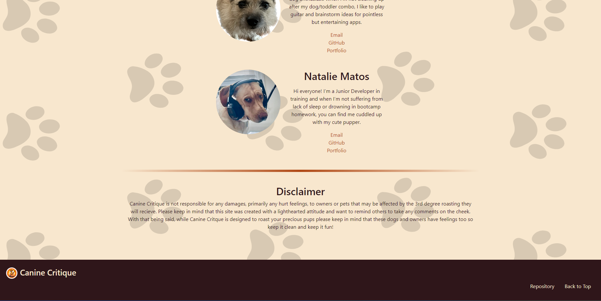
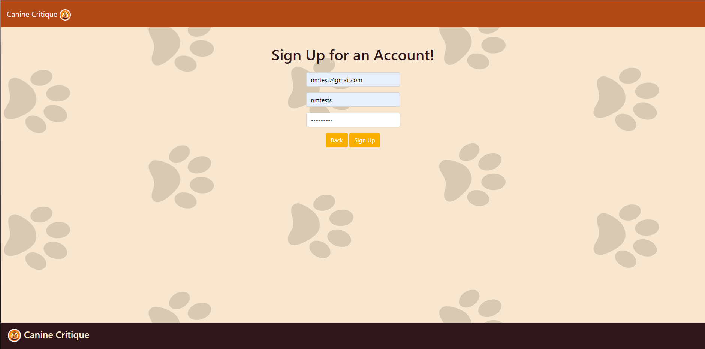
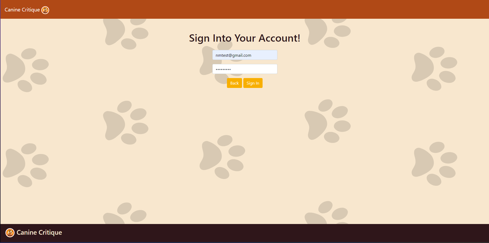
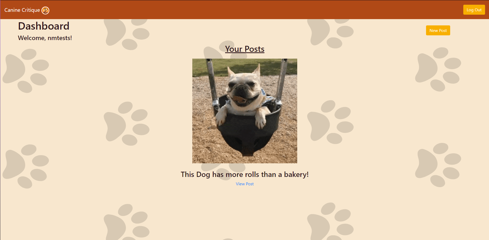
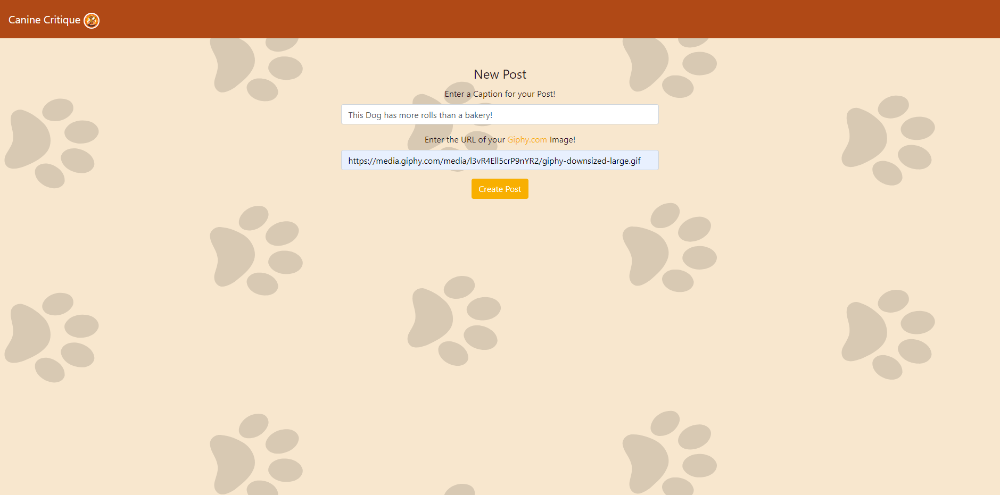

# Canine Critique

## Table of Contents

  * [Description](#description)
  * [Installation](#installation)
  * [Usage](#usage)
  * [Demos](#demos)
  * [Usage](#usage)
  * [Credits](#credits)
  * [License](#license)

## Description

Canine Critique is a application for dogs and dog lovers alike, centered around roasting your lovable pups. Through Canine Critique users can view images of dogs and roast them. They are also able to upload their own dogs to join in on the fun and get roasted. The application is designed to be light-hearted by allowing users to reduce stress through viewing cute dogs and adding to the fun by roasting them.

## Installation

N/A

## Usage

### Languages:

* HTML
* CSS
* JavaScript
* Markdown

### Technologies:

* Node.js
* NPMs: 
    * Bcrypt 
    * Dotenv 
    * Express
    * Express-handlebars
    * Express-session
    * Express-validator
    * Generate-unique-id
    * Multer
    * Mysql2
    * Nodemon
    * Sequelize
    * Uploader
* Framework:
    * Bootstraps

## Demos

Links below provide a functionality of webpage.

### Heroku

[Canine Critique](https://pet-roasting-app.herokuapp.com/)

### Screenshots

## Credits

### Resources:
* Rutger University: https://git.bootcampcontent.com/Rutgers-University/RUT-VIRT-FSF-FT-02-2023-U-LOLC
* [Color Palatte Generator](https://coolors.co)
* [Our Projects Color Palette](https://coolors.co/fbfbf8-b37034-6b2f17-452d2e-b04916-f8af01-f8e7ce-fdfdfe-2f161a)
* [Optional Chaining Mozilla](https://developer.mozilla.org/en-US/docs/Web/JavaScript/Reference/Operators/Optional_chaining)
* https://github.com/jdtdesigns/basic_mvc_auth_example/tree/mvc-auth-error-handling
* https://github.com/jdtdesigns/starwars_project2_example
* [Multer Tutorial](https://www.bezkoder.com/node-js-upload-image-mysql/)
* [Multer Tutorial](https://www.youtube.com/watch?v=wIOpe8S2Mk8)
* [Instagram Clone Using React](https://www.youtube.com/watch?v=UbixZZDjrdU)
* [ChatGPT](https://chat.openai.com)

### Contributors

* [Megan Mathis](https://github.com/MegMathis)
* [James Sciacca](https://github.com/jamessciacca)
* [Jeff Rosenblum](https://github.com/jcrosenblum)
* [Natalie Matos](https://github.com/nmatos12)

## License

This project is registered under the MIT license.